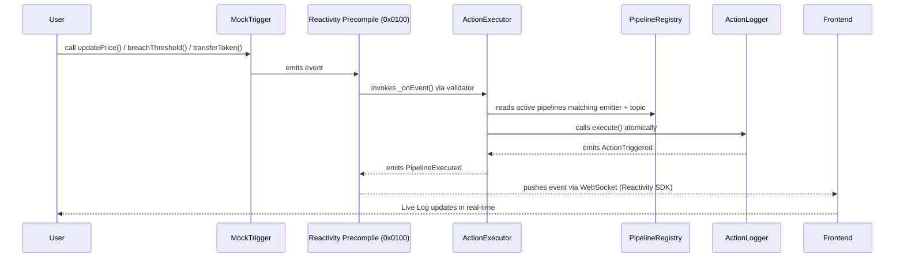
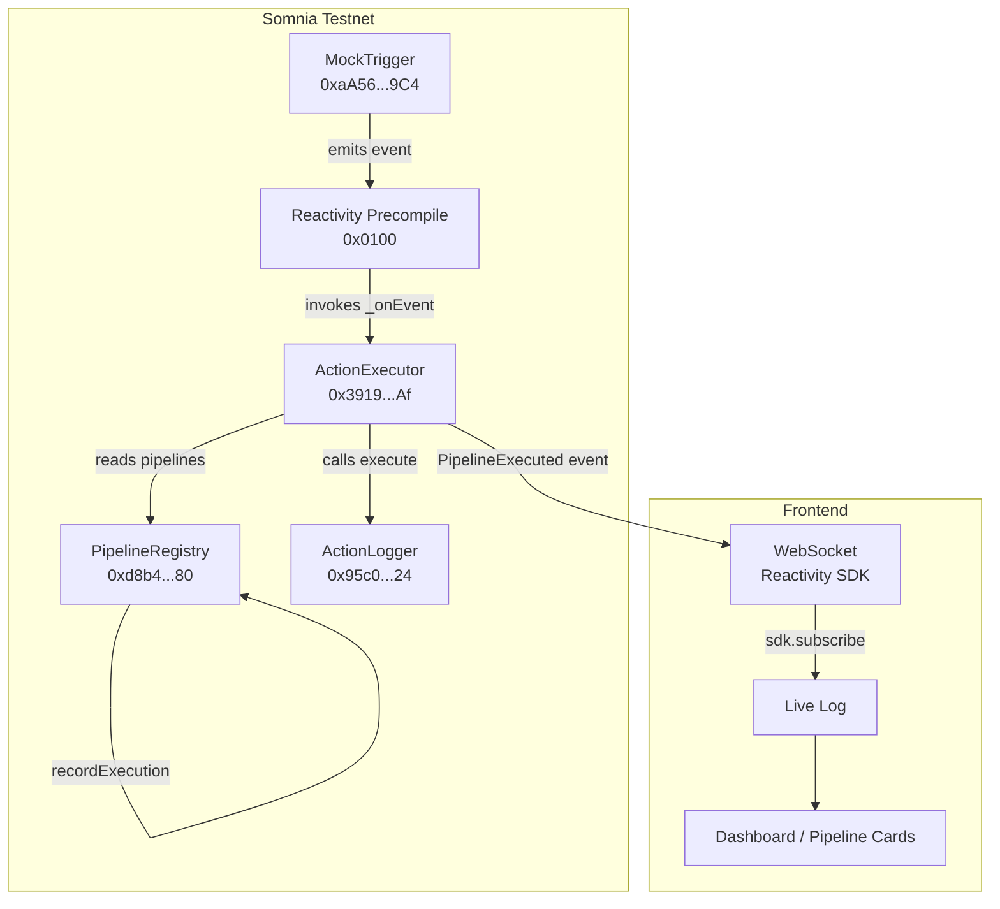

# ReactChain

> On-Chain Reactive Automation Hub — "Zapier for Somnia"

ReactChain is a trustless automation protocol built on [Somnia Native Reactivity](https://docs.somnia.network/developer/reactivity). Users compose reactive pipelines entirely on-chain: when a contract emits an event, a chain reaction executes automatically — no bots, no off-chain servers, no polling.

Built for the **Somnia Reactivity Mini Hackathon** · Deployed on Somnia Testnet

---

## How It Works



---

## Architecture



---

## Reactivity SDK Integration

ReactChain uses **both layers** of the Somnia Reactivity SDK.

### On-Chain — Solidity Handler

`ActionExecutor` inherits `SomniaEventHandler`. Validators invoke `_onEvent` directly in the EVM when `MockTrigger` emits any event:

```solidity
import { SomniaEventHandler } from "@somnia-chain/reactivity-contracts/contracts/SomniaEventHandler.sol";

contract ActionExecutor is SomniaEventHandler {
    function _onEvent(
        address emitter,
        bytes32[] calldata eventTopics,
        bytes calldata data
    ) internal override {
        // Scan PipelineRegistry for active pipelines matching emitter + topic
        // Call ActionLogger.execute() atomically for each match
        // Emit PipelineExecuted with success/fail status
    }
}
```

Subscription created via TypeScript SDK:

```ts
await sdk.createSoliditySubscription({
  emitter: MOCK_TRIGGER_ADDRESS,
  handlerContractAddress: ACTION_EXECUTOR_ADDRESS,
  priorityFeePerGas: parseGwei('2'),
  maxFeePerGas: parseGwei('10'),
  gasLimit: 2_000_000n,
  isGuaranteed: true,
  isCoalesced: false,
});
```

### Off-Chain — WebSocket Subscription

The frontend streams `PipelineExecuted` events in real-time via `sdk.subscribe()` — zero polling:

```ts
sdk.subscribe({
  ethCalls: [],
  eventContractSources: [ACTION_EXECUTOR_ADDRESS],
  onData: (data: SubscriptionCallback) => {
    // Decode PipelineExecuted → update Live Log instantly
  },
});
```

---

## Smart Contracts

| Contract | Address | Description |
|---|---|---|
| `PipelineRegistry` | [`0xd8b4875b61130D651409d26C47D49f57BEbC1780`](https://shannon-explorer.somnia.network/address/0xd8b4875b61130D651409d26C47D49f57BEbC1780) | Stores pipeline configs: trigger + topic → action + selector |
| `ActionExecutor` | [`0x391926D40EF9d7e94f5656c4d0A8698714ff20Af`](https://shannon-explorer.somnia.network/address/0x391926D40EF9d7e94f5656c4d0A8698714ff20Af) | `SomniaEventHandler` — invoked by validators, executes pipelines |
| `MockTrigger` | [`0xaA5685419dBd36d93dD4627da89B8f94c39399C4`](https://shannon-explorer.somnia.network/address/0xaA5685419dBd36d93dD4627da89B8f94c39399C4) | Demo event emitter: `PriceUpdated`, `ThresholdBreached`, `TokenTransferred` |
| `ActionLogger` | [`0x95c033E817023e2B1C4e6e55F70d488FeC39fd24`](https://shannon-explorer.somnia.network/address/0x95c033E817023e2B1C4e6e55F70d488FeC39fd24) | On-chain action: records permanent log entries, emits `ActionTriggered` |

**Reactivity Subscription Tx:** [`0xc83f46bf...`](https://shannon-explorer.somnia.network/tx/0xc83f46bf872ad2f91ebc3d61bc1cb315e114bd68c5112ff28f8f775652c3c3f3)

---

## Running Locally

```bash
# Frontend
cd frontend
npm install
npm run dev
```

```bash
# Contracts
cd contracts
npm install
npx hardhat compile
```

---

## Demo Flow

1. Connect MetaMask to Somnia Testnet
2. Create a pipeline: `MockTrigger → PriceUpdated → ActionLogger.execute()`
3. Click **Price Updated** in the Trigger Simulator
4. Watch the Live Log update in real-time via Reactivity SDK WebSocket
5. See execution count increment on the Pipeline Card automatically
6. Check the Subscription Status card — links directly to the on-chain subscription

---

## Tech Stack

| Layer | Technology |
|---|---|
| Reactivity | `@somnia-chain/reactivity` SDK — WebSocket + Solidity handler invocations |
| Smart Contracts | Solidity 0.8.30 — `SomniaEventHandler`, `PipelineRegistry`, `ActionLogger` |
| Frontend | React + Vite + TypeScript |
| Web3 | viem |
| UI | Tailwind CSS v4 + Framer Motion |
| Network | Somnia Testnet (Chain ID: 50312) |

---

## Links

- [Somnia Reactivity Docs](https://docs.somnia.network/developer/reactivity)
- [Somnia Testnet Explorer](https://shannon-explorer.somnia.network)
- [Somnia Testnet Faucet](https://docs.somnia.network/developer/network-info)
