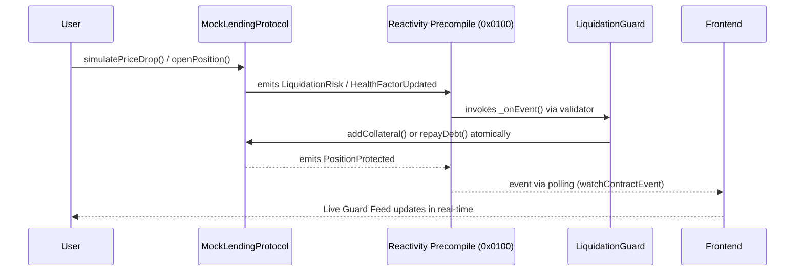
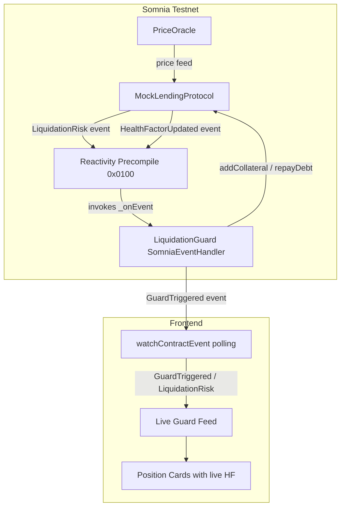

# ReactorShield

> Predictive On-Chain DeFi Guardian — Autonomous Reactive Liquidation & Collateral Optimizer

ReactorShield is a trustless DeFi protection protocol built on [Somnia Native Reactivity](https://docs.somnia.network/developer/reactivity). When a position's health factor drops, the on-chain guardian fires automatically — no bots, no off-chain servers, no polling.

Built for the **Somnia Reactivity Mini Hackathon** · Deployed on Somnia Testnet

---

## The Problem

DeFi liquidations wipe out billions in user funds every year. Existing solutions rely on off-chain bots that can be front-run, go offline, or miss events during network congestion. ReactorShield solves this at the protocol level using Somnia's Native Reactivity.

---

## How It Works



---

## Architecture



---

## How Reactivity Is Used

### On-Chain — Solidity Handler

`LiquidationGuard` inherits `SomniaEventHandler`. Validators invoke `_onEvent` directly in the EVM when `MockLendingProtocol` emits `LiquidationRisk` or `HealthFactorUpdated`:

```solidity
import { SomniaEventHandler } from "@somnia-chain/reactivity-contracts/contracts/SomniaEventHandler.sol";

contract LiquidationGuard is SomniaEventHandler {
    function _onEvent(
        address emitter,
        bytes32[] calldata eventTopics,
        bytes calldata data
    ) internal override {
        if (topic0 == LIQUIDATION_RISK_TOPIC) {
            // Auto top-up collateral by 20%
            lendingProtocol.addCollateral(positionId, collateral / 5);
        } else if (topic0 == HEALTH_FACTOR_TOPIC && hf < 1.15e18) {
            // Partial debt repay (10%) when critically low
            lendingProtocol.repayDebt(positionId, debt / 10);
        }
    }
}
```

Subscription created via TypeScript SDK:

```ts
await sdk.createSoliditySubscription({
  emitter: MOCK_LENDING_ADDRESS,
  handlerContractAddress: LIQUIDATION_GUARD_ADDRESS,
  gasLimit: 5_000_000n,
  isGuaranteed: true,
  isCoalesced: false,
});
```

### Off-Chain — Real-Time Frontend

The frontend streams `GuardTriggered`, `LiquidationRisk`, and `PositionProtected` events via `watchContractEvent` with 2s polling — position cards update live with health factor changes.

---

## Smart Contracts

| Contract | Description |
|---|---|
| `PriceOracle` | Mock price feed — emits `PriceCrashed` on drops ≥5% |
| `MockLendingProtocol` | Simulated lending protocol — tracks positions, emits `LiquidationRisk` |
| `LiquidationGuard` | `SomniaEventHandler` — auto-protects positions reactively |

---

## Running Locally

```bash
# Frontend
cd frontend && npm install && npm run dev

# Contracts
cd contracts && npm install && npx hardhat compile
```

### Deploy (Remix IDE)
1. Deploy `PriceOracle`
2. Deploy `MockLendingProtocol(oracleAddress)`
3. Deploy `LiquidationGuard(lendingProtocolAddress)`
4. Update addresses in `frontend/src/utils/contracts.ts`
5. Set `MOCK_LENDING_ADDRESS` + `LIQUIDATION_GUARD_ADDRESS` in `contracts/.env`
6. Run `npx hardhat run scripts/setup-subscription.ts --network somniaTestnet`

---

## Demo Flow

1. Connect MetaMask to Somnia Testnet
2. Click **Open Safe Position** — creates ETH-collateralized position
3. Click **Simulate Price Crash 50%** — health factor drops, `LiquidationRisk` fires
4. Watch the Live Guard Feed — `LiquidationGuard._onEvent()` fires via Reactivity validators
5. Position card updates — collateral auto-topped-up, health factor recovers
6. All of this happens on-chain, atomically, with zero off-chain intervention

---

## Tech Stack

| Layer | Technology |
|---|---|
| Reactivity | Somnia Native Reactivity SDK — `SomniaEventHandler` + `createSoliditySubscription` |
| Smart Contracts | Solidity 0.8.30 |
| Frontend | React + Vite + TypeScript |
| Web3 | viem |
| UI | Tailwind CSS v4 |
| Network | Somnia Testnet (Chain ID: 50312) |

---

## Links

- [Somnia Reactivity Docs](https://docs.somnia.network/developer/reactivity)
- [Somnia Testnet Explorer](https://shannon-explorer.somnia.network)
- [Somnia Testnet Faucet](https://testnet.somnia.network)
